<style>
body {
    margin: 0px auto;
    max-width: 1200px;
    font-family: sans-serif;
    font-size: 10pt;
}
table {
    margin-left: 65px;
    margin-right: 5px;
}
.table {
    max-width: 595px;
}
pre {
    margin: 0em 145px 0.5em 5em;
    padding: 0px 0px 0px 15px;
    border: 0px none;
    background-color: #e6e6e6;
    white-space: pre;
    overflow-x: auto;
    font-size: 90%;
}
p.caption {
    padding-left: 0px;
    padding-right: 85px;
    margin-bottom: 50px;
    margin-top: 10px;
    text-align: center;
}
code {
    background-color: #e6e6e6;
    color: #404040;
    font-size: 90%;
}
</style>

```{r, echo=FALSE}
knitr::opts_chunk$set(echo=TRUE, warning=FALSE, message=FALSE, fig.align="left", fig.show="hold", fig.keep='all')
```

# ABSTRACT
**AskoR** is a pipeline for the analysis of gene expression data, using edgeR.
Several steps are performed: data filters (cpm method), normalize this filtered data, look at the correlation of our data, run differential expression analysis, compare contrast, GO enrichment and co-expression.
<br/><br/>
You'll find a test set in the **inst/extdata/input** folder. It'll be used for the rest of the documentation. Contents of **input** folder: 

  - **Count matrix file**: CountsMatrix.txt **OR** Counts files per samples: files in "counts" directory _(counts.tgz)_
  - **Samples file**: Samples_CountsMatrix.txt **OR** Samples_CountsFiles.txt 
  - **Contrasts file**: Contrasts.txt
  - **Genes annotations file**: Genes_annotations.txt (optional)
  - **GO annotations file**: GO_annotations.txt (optional)

**IMPORTANT :** All input files must be in a folder named **input** _(case sensitive)_.

# Input files description
## Count files
### Sample count files
You have a count file **per sample**, they can be in text or csv format. In this case, you will have to fill in the **Samples** file with the path and name of the **count files** for each sample in a _**"file"**_ column. This one can contain several columns according to the counting tools used, you will have to inform the following parameters:

  - ```parameters$col_genes``` &nbsp; column number with GeneId (default 1)
  - ```parameters$col_counts``` &nbsp; column number with count (default 7)
  - ```parameters$sep``` &nbsp; column separator (default **"\\t"** ) 

Example of count file:

 Geneid | Chr | Start | End | Strand | Length | Counts
 :-|:-|-:|-:|:-:|-:|-:
 Gene_000001 | Random_Chr_001 | 1692 | 1907 | - | 215 | 0
 Gene_000002 | Random_Chr_001 | 6641 | 8705 | - | 2064 | 43.5
 Gene_000003 | Random_Chr_001 | 9228 | 9569 | - | 341 | 8
 Gene_000004 | Random_Chr_001 | 12009 | 13155 | - | 1146 | 781
 Gene_000005 | Random_Chr_001 | 15242 | 15844 | + | 602 | 16
 Gene_000006 | Random_Chr_001 | 16304 | 19834 | + | 3530 | 9
 Gene_000007 | Random_Chr_001 | 20595 | 21625 | - | 1030 | 13.83
 Gene_000008 | Random_Chr_001 | 22377 | 23461 | - | 1084 | 565.33
 **...** |

The corresponding parameters:
```{r counts_files, eval=FALSE}
parameters$col_genes=1
parameters$col_counts=7
parameters$sep="\t"
```
In this example column 7 contains the counts and the gene identifiers are in the first column, it's a tabulate file so the column separator is <TAB> encoded "\\t".

### Counts matrix file
It is also possible to have a table, **tabulated file**, grouping the counts for each gene in each sample, in text or csv format. The **Samples** file should not contain a **file** column, you will have to fill in the name of the count file: ```parameters$fileofcount```.
<br/><br/>
Example of a count matrix, the column separator is a tabulation:

 Geneid | AC1R1 | AC1R2 | AC1R3 | BC1R1 | BC1R2 | BC1R3 | **...**
 :-|-:|-:|-:|-:|-:|-:|:-:
 Gene_000001 | 0 | 1 | 0 | 0 | 0 | 1 | **...**
 Gene_000002 | 43.5 | 25.33 | 31.5 | 27.5 | 29.5 | 29 | **...**
 Gene_000003 | 8 | 4 | 5 | 30 | 16 | 13 | **...**
 Gene_000004 | 781 | 412 | 626 | 558 | 538 | 346 | **...**
 Gene_000005 | 16 | 7 | 13 | 9 | 8 | 6 | **...**
 Gene_000006 | 9 | 4 | 5 | 21 | 15 | 12 | **...**
 **...** |


## Samples file
This **tabulated file** describes the design of experiments. The first and second columns are mandatory and are named **"sample"** and **"condition"**. You may have several other columns. The contents of the condition column will be the same as in the **Contrast** file.
<br/><br/>
The column **"color"** is optional, it allows to predefined the color of the sample in the graphs. If it is absent askoR will assign colors itself.
<br/><br/>
The column **"file"** is mandatory if you have samples counts files. In the example below, these files are grouped in a _"counts"_ folder. You do not need to specify the name of the **"input"** folder (i.e. input/counts/AC1R1_counts.txt) since, by default, it will search for it.
<br/><br/>
Don't forget to fill in the name of your Samples file: ```parameters$sample_file```, no need to specify the "input" folder.
<br/><br/>
Example of a Samples.txt file:

 sample | condition | genotype | treatment | color | file
 :-|:-|:-|:-|:-|:-
 AC1R1 | AC1 | A | C1 | darkorchid2 | counts/AC1R1_counts.txt
 AC1R2 | AC1 | A | C1 | darkorchid2 | counts/AC1R2_counts.txt
 AC1R3 | AC1 | A | C1 | darkorchid2 | counts/AC1R3_counts.txt
 BC1R1 | BC1 | B | C1 | saddlebrown | counts/BC1R1_counts.txt
 BC1R2 | BC1 | B | C1 | saddlebrown | counts/BC1R2_counts.txt
 **...** |


## Contrast file
This **tabulated file** indicates contrasts you wish to make between your different **conditions**.
The first column corresponds to the *condition* column of the **Samples** file, then the others are columns the comparisons to be made in the form **ConditionXvsConditionY**. Then under these columns, **ConditionX** will be noted **+** and **ConditionY** will be noted **-**, the rest **0**. You will have to fill in the name of your file: ```parameters$contrast_file```
<br/><br/>
Example of contrasts file:

 Condition | AC1vsAC2 | AC1vsAC3 | AC2vsAC3 | BC1vsBC2 | **...**
 :-|:-|:-|:-|:-|:-
 AC1 | + | + | 0 | 0 | **...**
 AC2 | - | 0 | + | 0 | **...**
 AC3 | 0 | - | - | 0 | **...**
 BC1 | 0 | 0 | 0 | + | **...**
 BC2 | 0 | 0 | 0 | - | **...**
 **...** |


## Genes annotations file
This **tabulated file** contains the annotations of your genes, it is optional. It can contain several columns but the first one must be the gene identifier.  You will have to fill in the name of your file: ```parameters$annotation```.
<br/><br/>
Example of annotation file:

 SeqName | Description
 :-|:-
 Gene_000001 | hypothetical protein pbra 009537
 Gene_000002 | hypothetical protein pbra 009324
 Gene_000003 | histone-lysine n-methyltransferase nsd2
 Gene_000004 | hypothetical protein pbra 009496
 **...** |


## GO annotations file 
This **tabulated file** will be **WITHOUT HEADER**, the first column contains the gene identifier and the second column contains all the corresponding GOs separated by a **comma**. This file is optional, you will have to fill in its name: ```parameters$geneID2GO_file```. [Cf. GO enrichment Section](#GO)
<br/><br/>
Example of GOs annotation file:

 &nbsp; | &nbsp; 
 :-|:-
 Gene_000001 | &nbsp;&nbsp;&nbsp;&nbsp;GO:0003676,GO:0015074
 Gene_000002 | &nbsp;&nbsp;&nbsp;&nbsp;GO:0003676,GO:0015074
 Gene_000003 | &nbsp;&nbsp;&nbsp;&nbsp;GO:0005488,GO:0006807,GO:0016740,GO:0043170,GO:0044238
 Gene_000005 | &nbsp;&nbsp;&nbsp;&nbsp;GO:0005525,GO:0005525,GO:0005525
 **...** |


# Out files
All the generated files and images will be in a folder named by default **"DE_analysis"**, you can change this name: ```parameters$analysis_name```.

# Initialize and load data
Now that we have our input files, look at the script, you should have these first lines:
```{r run_askor1, eval=FALSE}
# Path to askoR file 
library(askoR)

# Sets defaults parameters
parameters<-Asko_start()
```
Don't forget to r}place the paths, the first one to the _askoR.R_ script and the second one to your working directory (containing the **input** folder).
<br/><br/>
Once this step has been completed, you will be able to indicate the names of the analysis files:
```{r run_askor2, eval=FALSE}
# output directory name (default DE_analysis)
parameters$analysis_name="DEG_test"

# input files:
# matrix of different contrasts desired
parameters$contrast_file = "Contrasts.txt"    
# file containing the functional annotations for each gene
parameters$annotation = "Genes_annotations.txt"      
# GO annotation files
parameters$geneID2GO_file = "GO_annotations.txt"   
```
 - If you use a counts matrix :
```{r run_askor3a, eval=FALSE}
# matrix of count for all samples/conditions
parameters$fileofcount = "CountsMatrix.txt"  
# file describing all samples
parameters$sample_file = "Samples_CountsMatrix.txt"  
```
 - If you use files of counts :
```{r run_askor3b, eval=FALSE}
# file describing all samples
parameters$sample_file = "Samples_CountsFiles.txt"
# column with the gene names (default 1)
parameters$col_genes = 1          
# column with the counts values (default 7)
parameters$col_counts = 7 
# field separator (default "\t")
parameters$sep = "\t" 
```
We are informed that two samples, "AC3R2" and "BC3R3", had problems during the experiments, it is requested to extract it from our analysis. No need to redo all the files, just use the parameter: ```parameters$rm_sample```.  You can provide a list of samples **"c("sample1","sample2","sample3",...)**, or a single sample **c("sample1")**. In the same way, if you only want to work on a part of your samples, you can use ```parameters$select_sample```.
```{r run_askor3c, eval=FALSE}
# delete sample AC3R2 
parameters$rm_sample = c("AC3R2","BC3R3")
```
It's time to load your data:
```{r run_askor4, eval=FALSE}
data<-loadData(parameters)
```
```{r exec1, echo=FALSE, message=FALSE, warning=FALSE}
rm(list=ls())
library(askoR)
#source("C:/DATA_KEVIN/INRA/AskoR/ScriptR/AskoR.R")


parameters<-Asko_start()
parameters$dir_path="../inst/extdata/"
parameters$analysis_name="DEG_test"
parameters$fileofcount = "CountsMatrix.txt"  
parameters$sample_file = "Samples_CountsMatrix.txt"  
parameters$contrast_file = "Contrasts.txt"    
parameters$annotation = "Genes_annotations.txt"  
parameters$geneID2GO_file = "GO_annotations.txt"
parameters$rm_sample = c("AC3R2","BC3R3")
parameters$CompleteHeatmap = TRUE
data<-loadData(parameters)
``` 
You can see that **DataExplore** folder has been created in DEG_test:

Then the samples and conditions that have been loaded are displayed. These have been loaded into a structure called **"data"**. Some commands to display your data:
```{r run_askor4b}
# Displays all samples recorded
data$samples  

# Displays all contrast recorded
data$contrast 

# Displays design experiment
data$design   

# Displays the first 5 lines and 8 columns of counts table.
data$dge$counts[1:5,1:8] 

# Total number of genes:
dim(data$dge$counts)[1]

# Total number of samples:
dim(data$dge$counts)[2]
```

The next step is to generate the files describing your experiences for Askomics. Even if you don't plan to use Askomics, this command is **mandatory** because it generates a data structure **"asko_data"** that will be used in the further analysis.
```{r run_askor5}
asko_data<-asko3c(data, parameters)
```

# Filtering data
For the filters the CPM method is used, you can set the cutoff values you want to:
```{r run_askor6a}
# CPM's threshold 
parameters$threshold_cpm = 0.5  
# minimum of sample which are upper to cpm threshold 
parameters$replicate_cpm = 3 # we have 3 replicates
```

```{r run_askor6b}
# run filtering 
asko_filt<-GEfilt(data, parameters)

# Total number of filtered genes: 
dim(asko_filt$counts)[1]
```
The filtered data is saved in a structure called here: **asko_filt**. In the folder **DEG_test/DataExplore/**, you should find the images representing your data before and after filtering.<br/><br/>

```{r filters1a, echo=FALSE, out.width='43%', fig.cap="Filtering Data", out.extra='style="display:inline-block;margin:0;padding:0;"'}
knitr::include_graphics("../inst/extdata/DEG_test/DataExplore/DEG_test_boxplot_logcpm_before_filtering.png")
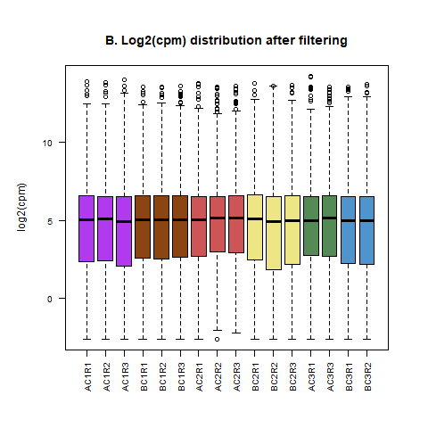
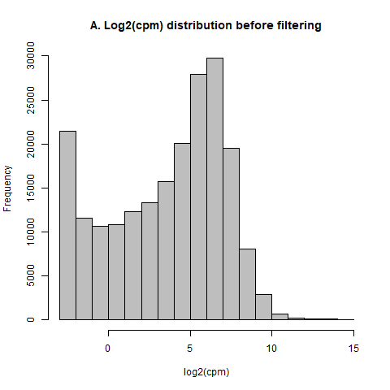
knitr::include_graphics("../inst/extdata/DEG_test/DataExplore/DEG_test_barplot_logcpm_after_filtering.png")
```

```{r filters1b, echo=FALSE, out.width='43%', fig.cap="Density Graphes", out.extra='style="display:inline-block;margin:0;padding:0;"'}
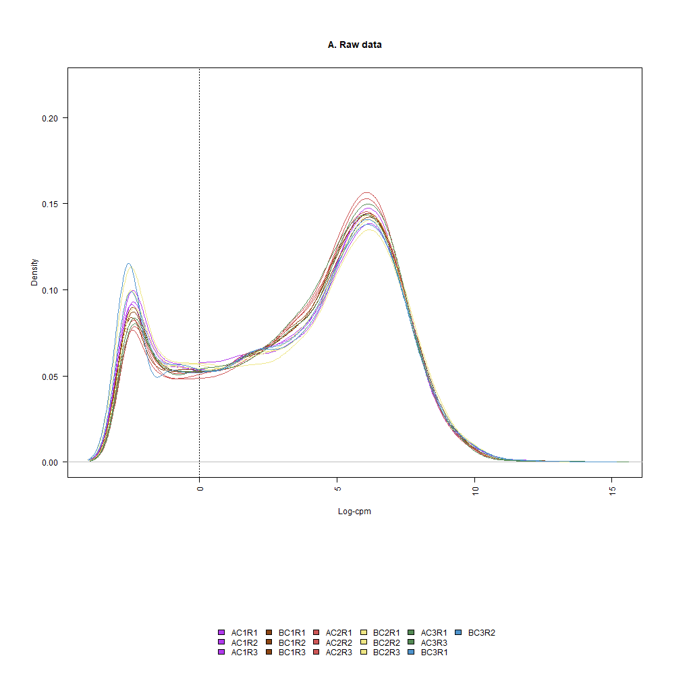
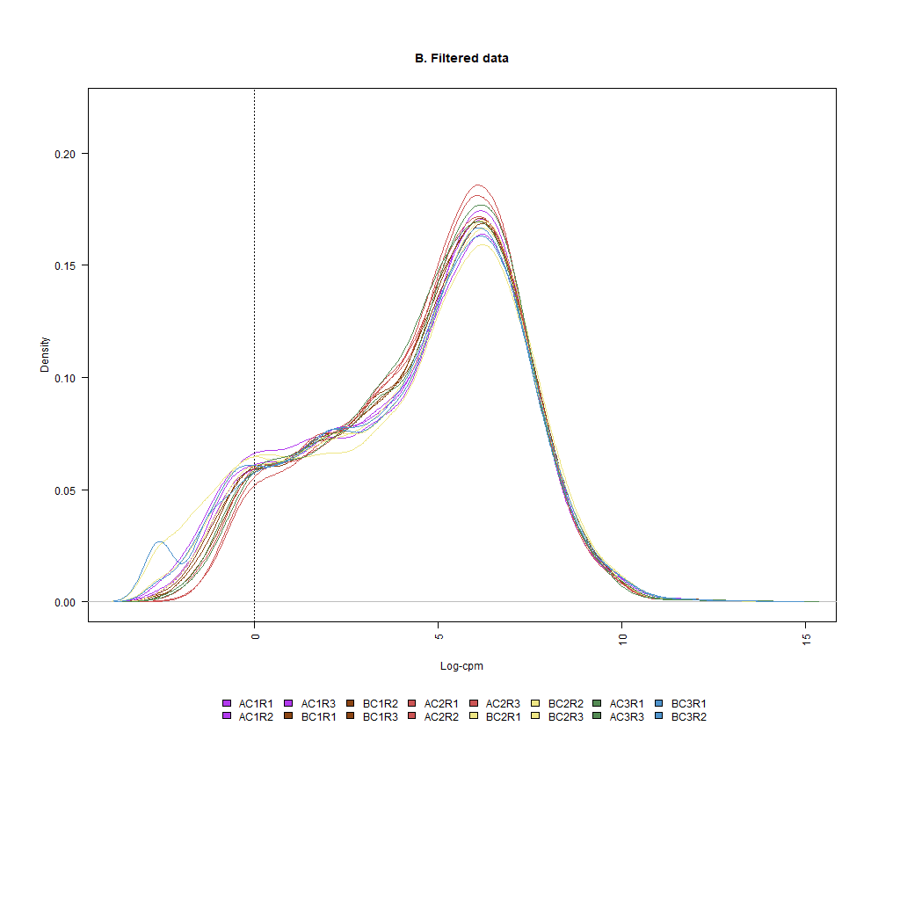
```

You notice that the legend of the density graphs is very low compared to the graph. You can correct this with the options ```parameters$densinset``` which modifies the position of the legend, it is also possible to define the number of columns with ```parameters$legendcol```. Finally, restart "GEfilt" function.

```{r param1}
# Set position the legend in bottom density graphe
parameters$densinset = 0.20
# Set numbers of column for legends
parameters$legendcol = 8
# run filtering
asko_filt<-GEfilt(data, parameters)
```
```{r filters2, echo=FALSE, out.width='43%', fig.cap="Density Graphes Corrected", out.extra='style="display:inline-block;margin:0 0 -50px 0;padding:0;"'}


```

# Normalize data
Once the filters have been made, we can proceed to the normalization of the data. At this step, you can generate file with normalize factor values for each sample ```parameters$norm_factor=TRUE``` and/or generate with normalize counts ```parameters$norm_counts=TRUE```.

```{r run_askor7}
# run normalization
asko_norm<-GEnorm(asko_filt, asko_data, data, parameters)
```
Normalized data is saved in a structure called here : **asko_norm**. In the folder **"DEG_test/DataExplore/"**, you should find the images representing your data after normalization. Two files are automatically generated because they will be used for co-expression analysis: _"DEG_test_CPMNormCounts.txt"_ and _"DEG_test_CPM_NormMeanCounts.txt"_.<br/><br/>

```{r norm, fig.cap="Normalization graphs (barplot)", echo=FALSE, out.width='43%', fig.align='center', out.extra='style="display:inline-block;margin:0;padding:0;"'}
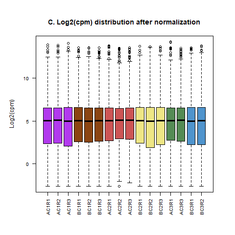
```
```{r norm2, fig.cap="Normalization graphs (heatmap)", echo=FALSE, out.width='43%', out.extra='style="display:inline-block;margin:0;padding:0;"'}
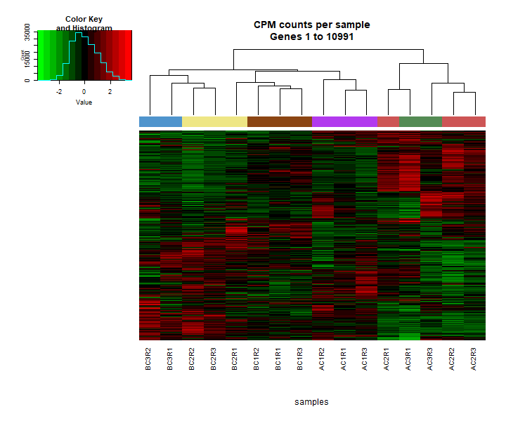
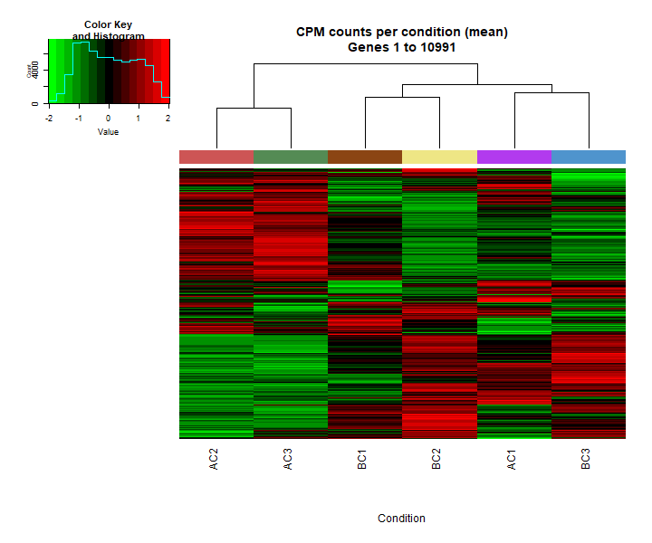
```

# Correlation
From the filtered and normalized data, we can re-correlate the correlation between our samples.
```{r run_askor8}
GEcorr(asko_norm,parameters)
```
Several graphics will be saved in the **"DEG_test/DataExplore/"** folder, including MDS and PCA plots. Axis1 vs axis2 differentiate our A and B samples.<br/><br/>

```{r corr, fig.cap="MDS and PCA plots - axis 1 and 2", echo=FALSE, out.width='43%', out.extra='style="display:inline-block;margin:0;padding:0;"'}
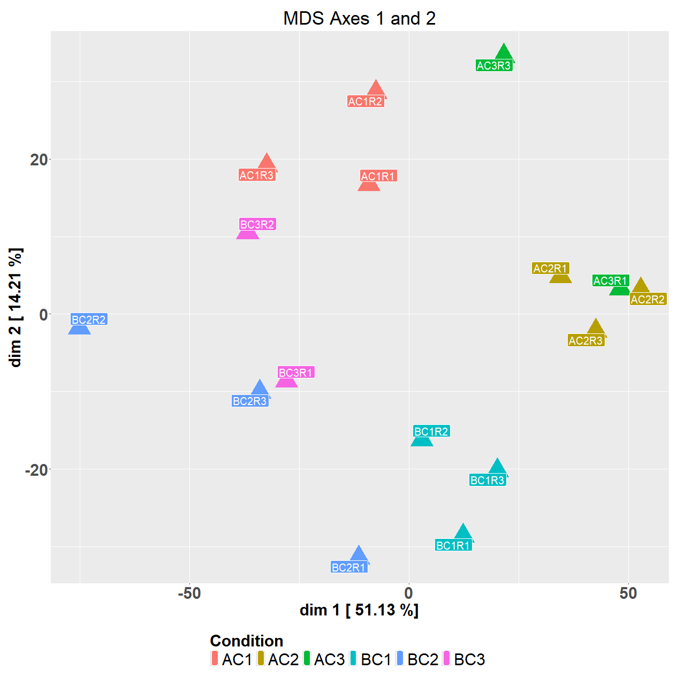
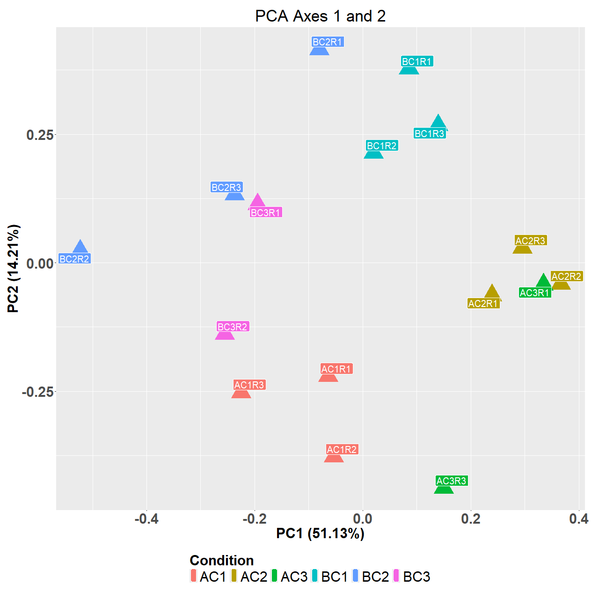
```

# DE analysis
The differential expression analysis can be started. We will play with the following parameters:

 - FDR threshold value
 - logFC threshold value
 - normalization method (TMM/RLE/upperquartile/none)
 - p-value adjust method (holm/hochberg/hommel/bonferroni/BH/BY/fdr/none)
 - GLM method (lrt/qlf)

```{r run_askor9a}
# FDR threshold
parameters$threshold_FDR = 0.05
# logFC threshold
parameters$threshold_logFC = 0
# normalization method
parameters$normal_method = "TMM"
# p-value adjust method
parameters$p_adj_method = "BH"
# GLM method
parameters$glm = "lrt"
```
You can decide to get the Volcano or Mean-Difference Plots for each contrast:
```{r run_askor9b}
# Mean-Difference Plot of Expression Data (aka MA plot)
parameters$plotMD = TRUE
# Volcano plot for a specified coefficient/contrast of a linear model
parameters$plotVO = TRUE
```
Once our parameters are defined, we can start the analysis.
```{r run_askor9c}
# run differential expression analysis
resDEG<-DEanalysis(asko_norm, data, asko_data, parameters)
```
For each contrast, you will find the number of over- or under-expressed genes. Genotype B does not show any major effects of the treatment, unlike genotype A. We also observe a certain number of differentially expressed genes between the genotypes.<br/>
<br/>
A file named **"Summary_DEresults.txt"** is located in the **DEG_test/DEanalysis/DEtables** folder, which contains for each gene whether it is over-expressed (**1**) or under-expressed (**-1**) or neutral (**0**) for a given contrast. If you had provided an annotation file, these will be found in the last columns.<br/>
<br/>
First lines of the :

|  | AC1vsAC2 | AC1vsAC3 | **...** | AC2vsBC2 | AC3vsBC3 | Description
:-|:-:|:-:|:-:|:-:|:-:|:-
Gene_000002 | 0 | 0 | **...** | 0 | 0 | hypothetical protei...
Gene_000003 | -1 | 0 | **...** | 0 | 0 | histone-lysine n-m...
Gene_000004 | 1 | 1 | **...** | -1 | 0 | hypothetical prote...
**...** |

You'll find in **"DEG_test/DEanalysis/DEimages"** directory, les Volcano, MD plots and heatmap for each contrast.<br/><br/>

```{r dge, fig.cap="DEanalysis plots", echo=FALSE, out.width='43%', out.extra='style="display:inline-block;margin:0;padding:0;"'}
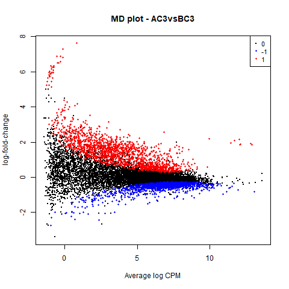
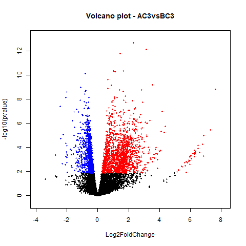
```

```{r dge2, fig.cap="DEanalysis plots", echo=FALSE, out.width='50%', fig.align='center', out.extra='style="display:inline-block;margin:0;padding:0;"'}
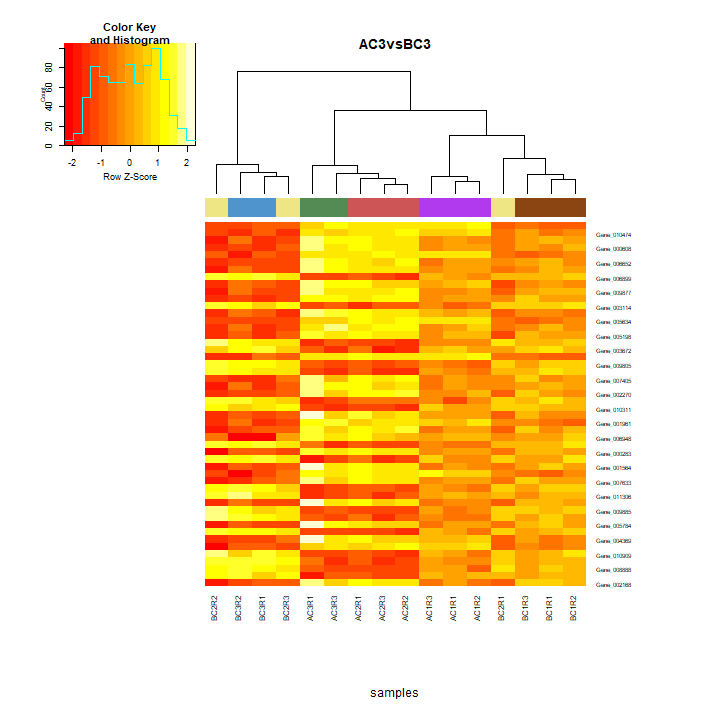
```

# Basic comparisons
You can compare your lists of differentially expressed genes using two methods: Venn diagrams or Upset graphs. Venn diagrams allow you to compare up to 4 lists while Upset allows you to make wider comparisons. However, if you have too many lists to display the graph may be unreadable.

## Venn diagram
To display the Venn diagrams, you need to specify the type of comparison wanted ```parameters$VD```:

 - "all"  : Create VennDiagrams for all differentially expressed genes
 - "up"   : Create VennDiagrams for gene expressed UP
 - "down" : Create VennDiagrams for gene expressed DOWN
 - "both" : Create VennDiagrams for gene expressed UP and DOWN (in the same graph)

Next, you must provide a list of the comparisons to display: ```parameters$compaVD```. For exemple :
```{r exemple1}
# this create 1 venn diagram
parameters$compaVD=c("Ctrast1-Ctrast2-Ctrast3") 
# this create 3 venn diagrams
parameters$compaVD=c("Ctrast1-Ctrast2-Ctrast3", 
                     "Ctrast4-Ctrast5-Ctrast6",
                     "Ctrast7-Ctrast8-Ctrast9")
```
Be careful, with the VD="both" you will only have to provide two contrasts. Example:
```{r exemple2}
# this create 1 venn diagram
parameters$compaVD=c("Ctrast1-Ctrast2") 
# this create 3 venn diagrams
parameters$compaVD=c("Ctrast1-Ctrast2", 
                     "Ctrast1-Ctrast3",
                     "Ctrast2-Ctrast3")
```
With our data, we will make 3 Venn diagrams for the different types (all, up and down).
```{r venn1, eval=FALSE}
parameters$compaVD = c("AC1vsAC2-AC1vsAC3-AC2vsAC3",
                       "BC1vsBC2-BC1vsBC3-BC2vsBC3",
                       "AC1vsBC1-AC2vsBC2-AC3vsBC3")


# graph type "all"
parameters$VD = "all"
VD(resDEG, parameters, asko_data)

# graph type "up"
parameters$VD = "up"
VD(resDEG, parameters, asko_data)

# graph type "down"
parameters$VD = "down"
VD(resDEG, parameters, asko_data)
```
To use the VD="both" option, we can provide list of two contrasts.
```{r venn2, eval=FALSE}
# graph type "both"
parameters$compaVD = c("AC1vsBC1-AC2vsBC2",
                       "AC1vsBC1-AC3vsBC3",
                       "AC2vsBC2-AC3vsBC3")
parameters$VD = "both"
VD(resDEG, parameters, asko_data)
```
All graphs will appear in a folder named **"DEG_test/VennDiagrams/"**. Some example of venn diagrams :<br/><br/>

```{r venndiagram, fig.cap="Venn Diagrams", echo=FALSE, out.width='43%', out.extra='style="display:inline-block;margin:0;padding:0;"'}
knitr::include_graphics("../inst/extdata/DEG_test/VennDiagrams/AC1vsBC1-AC2vsBC2-AC3vsBC3_all.png")
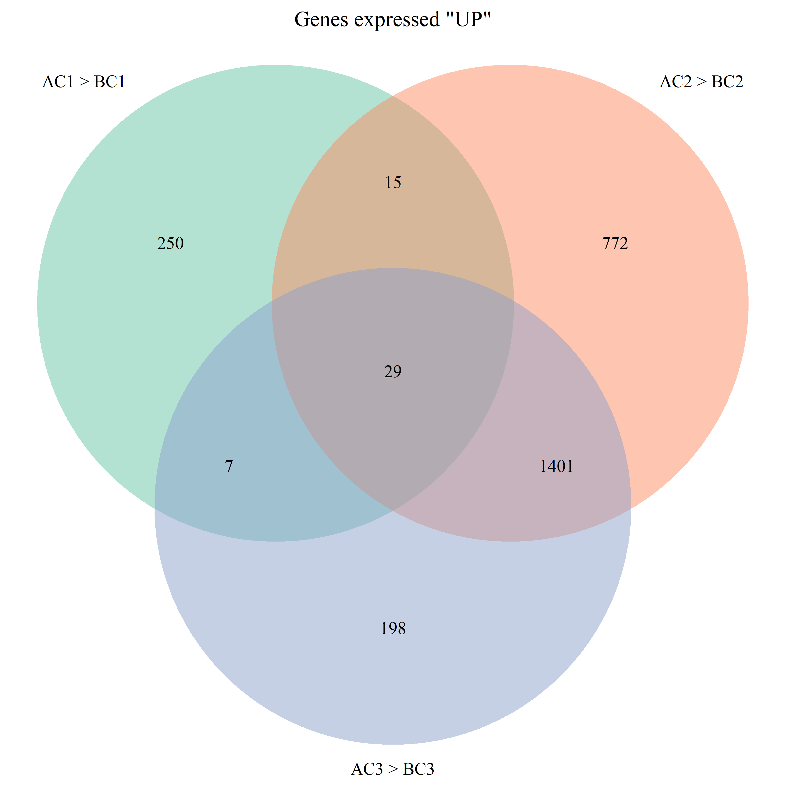
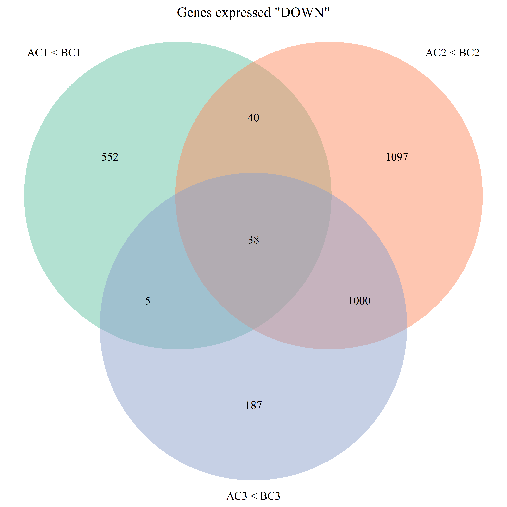
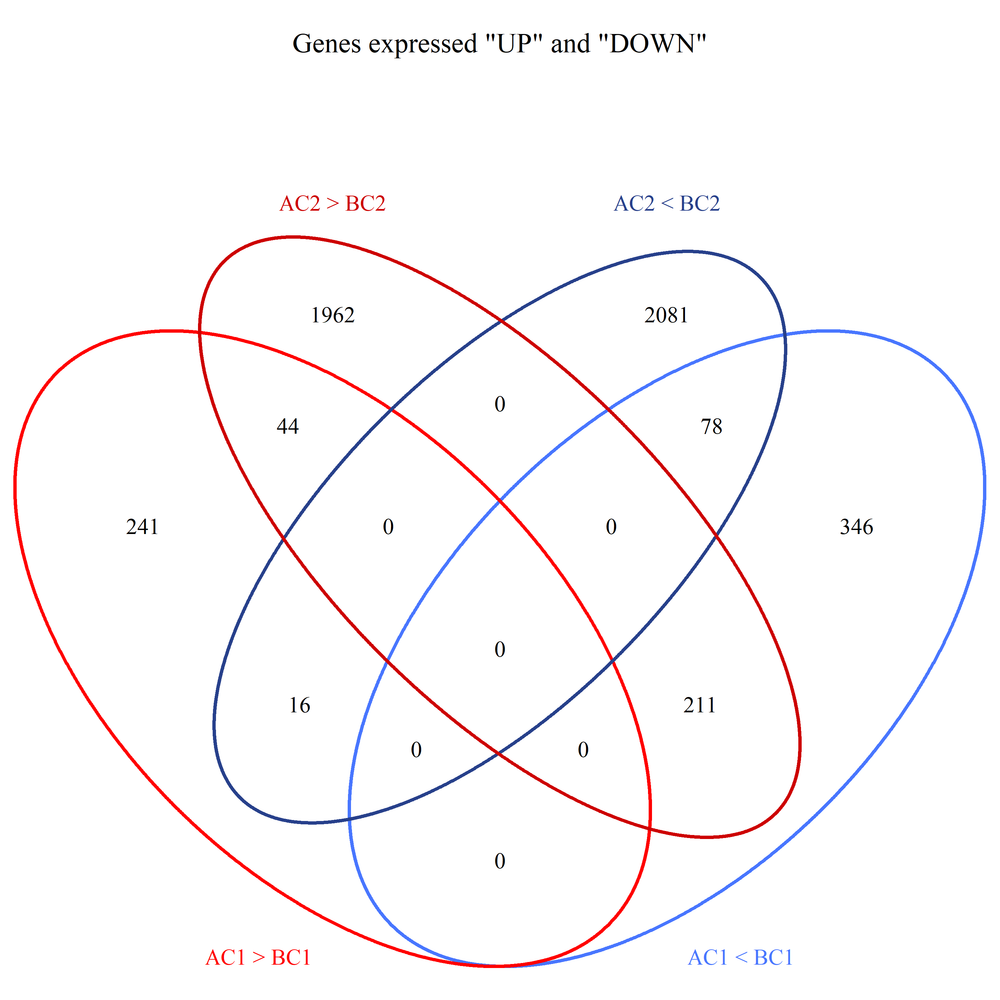
```

## Upset graphs
You can display all contrast, you just need to specify the type of comparison wanted ```parameters$upset_basic```:
 - "all"   : Create chart for all differentially expressed genes
 - "up"    : Create chart for gene expressed UP
 - "down"  : Create chart for gene expressed DOWN
 - "mixed" : Create chart for gene expressed UP and DOWN (in the same graph)
 - NULL    : Don't make graphs
You can display multiples graphs based on list of contrast ```parameters$upset_list```, you need to precise the type of comparison ```parameters$upset_type```. Example:
```{r exemple3}
# Precise type of comparison: all, down, up, mixed.
parameters$upset_type = "all"

# Give a list of contrast, for example:
# this create 1 graphs
parameters$upset_list = c("Ctrast1-Ctrast2-Ctrast3")   
# this create 3 graphs
parameters$upset_list = c("Ctrast1-Ctrast2-Ctrast3",  
                          "Ctrast4-Ctrast5-Ctrast6",
                          "Ctrast1-Ctrast2-Ctrast3-Ctrast4-Ctrast5")
```
With our data, we will make several upset charts for the different types (all, up, down and mixed), with all contrast and list of contrast.
```{r upset, eval=FALSE}
parameters$upset_list = c("AC1vsAC2-AC1vsAC3-AC2vsAC3",
                          "BC1vsBC2-BC1vsBC3-BC2vsBC3",
                          "AC1vsBC1-AC2vsBC2-AC3vsBC3")

# graphs type "all"
parameters$upset_basic = "all" # all contrast
parameters$upset_type = "all"  # list of contrast
UpSetGraph(resDEG, data, parameters)

# graphs type "mixed"
parameters$upset_basic = "mixed" # all contrast
parameters$upset_type = "mixed"  # list of contrast
UpSetGraph(resDEG, data, parameters)

# graphs type "up"
parameters$upset_basic = "up" # all contrast
parameters$upset_type = "up"  # list of contrast
UpSetGraph(resDEG, data, parameters)

# graphs type "down"
parameters$upset_basic = "down" # all contrast
parameters$upset_type = "down"  # list of contrast
UpSetGraph(resDEG, data, parameters)
```
An **"DEG_test/UpsetGraphs/"** directory will be created with two subdirectories **"DEG_test/ UpSetR_graphs/Global_upset/"** and **"DEG_test/UpsetGraphs/Subset_upset/"**.<br/>
Some example of upset graphs (from subset _"AC1vsBC1-AC2vsBC2-AC3vsBC3"_):<br/><br/>

```{r upsetR, fig.cap="UpsetR Graphs", echo=FALSE, out.width='43%',  out.extra='style="display:inline-block;margin:0;padding:0;"'}
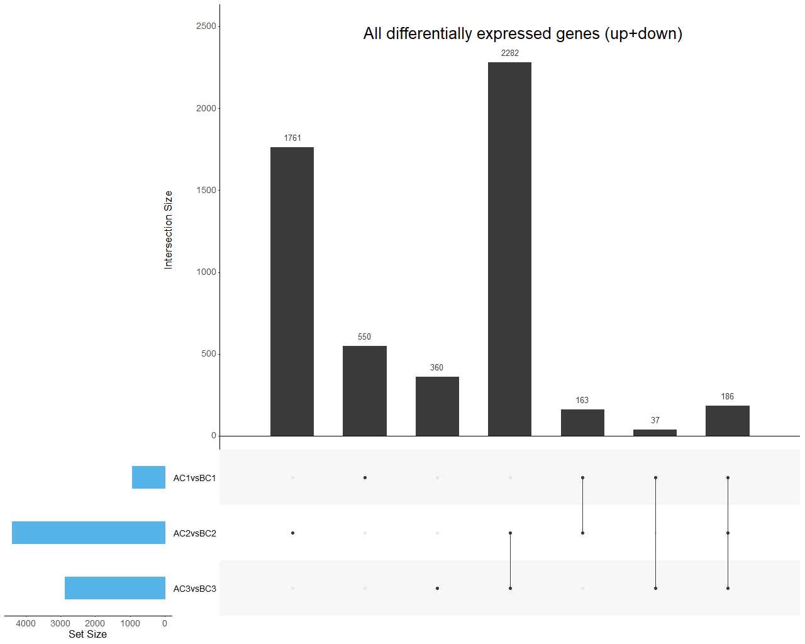
knitr::include_graphics("../inst/extdata/DEG_test/UpsetGraphs/Subset_upset/AC1vsBC1-AC2vsBC2-AC3vsBC3_upDEG.png")
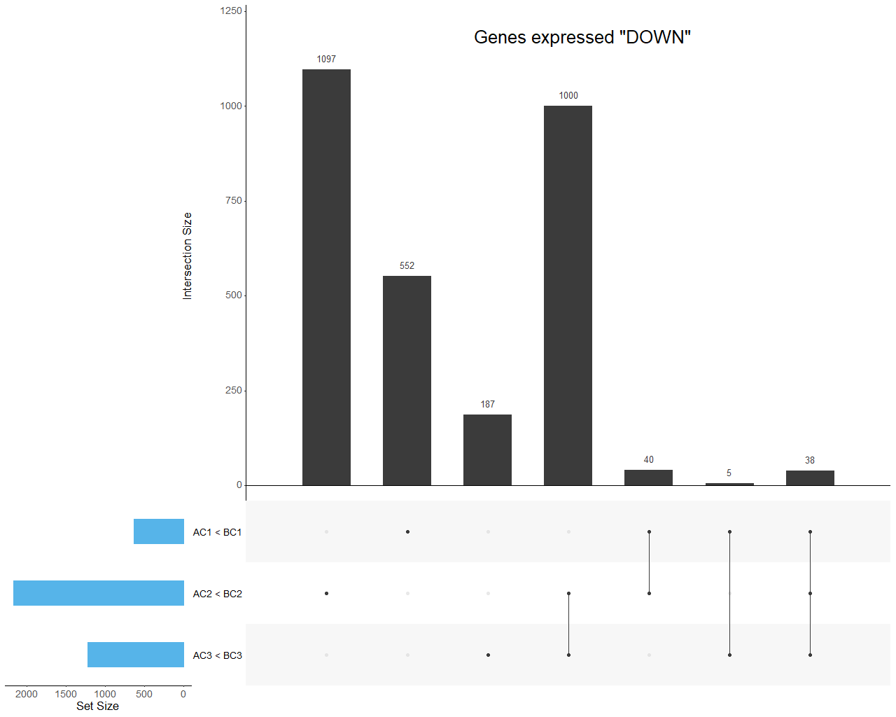
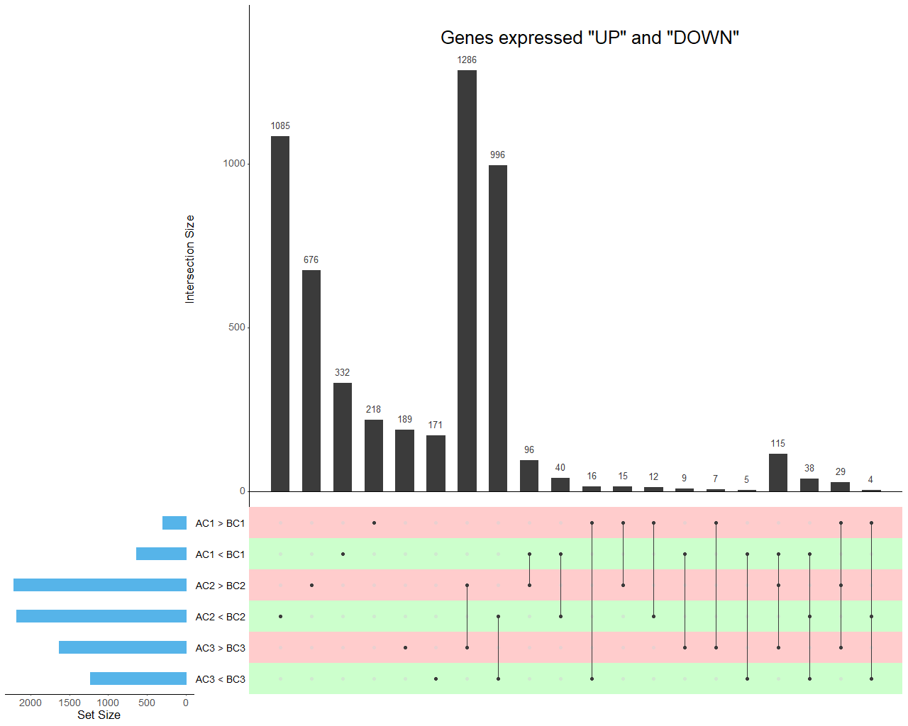
```

# GO Enrichment Analysis {#GO}
We uses the GOs annotations file to perform enrichment analysis on differentially expressed gene. For this, you define :

 - ```parameters$GO_threshold``` &nbsp;the significant threshold used to filter p-values
 - ```parameters$GO_max_top_terms``` &nbsp;the maximum number of GO terms plot
 - ```parameters$GO_min_num_genes``` &nbsp;the minimum number of genes for each GO terms
 - ```parameters$GO``` &nbsp;gene set chosen for analysis 'up', 'down', 'both' (up+down)
 - ```parameters$GO_algo``` &nbsp;algorithms for runTest function ("classic", "elim", "weight", "weight01", "lea", "parentchild")
 - ```parameters$GO_stats``` &nbsp;statistical tests for runTest function ("fisher", "ks", "t", "globaltest", "sum", "ks.ties")
 - ```parameters$Ratio_threshold``` &nbsp;the min ratio for display GO in graph

After that, we can run Go enrichment analysis:
```{r GO, eval=FALSE}
# Parameters
parameters$GO_threshold = 0.05
parameters$GO_max_top_terms = 10
parameters$GO_min_num_genes = 10
parameters$GO = "both"
parameters$GO_algo = "weight01"
parameters$GO_stats = "fisher"
parameters$Ratio_threshold = 1

# run analysis
GOenrichment(resDEG, data, parameters)
```
A **"DEG_test/GOenrichment/"** directory will be created with all GO images and tables of statistics.
Example of graph:<br/><br/>

By changing **parameters$GO** to "up" or "down", you can exevute GO-term enrichment on UP-regulated genes or DOWN-regulated genes separately.

```{r GOgraph, fig.cap="GO Enrichment graphs", echo=FALSE, out.width='43%',  out.extra='style="display:inline-block;margin:0;padding:0;"'}
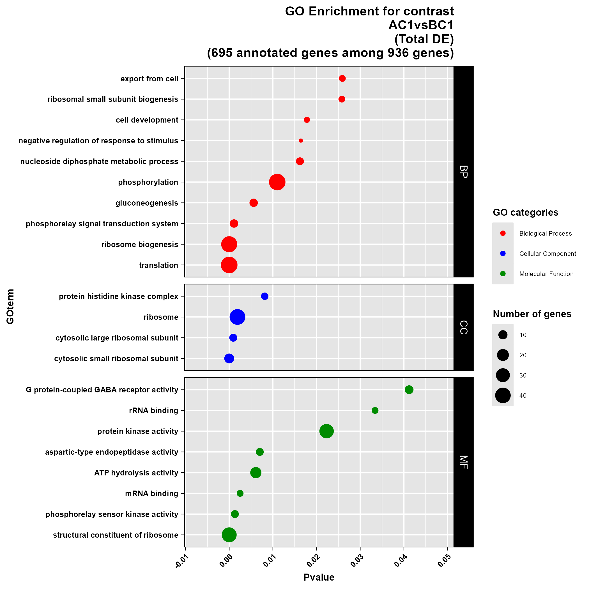
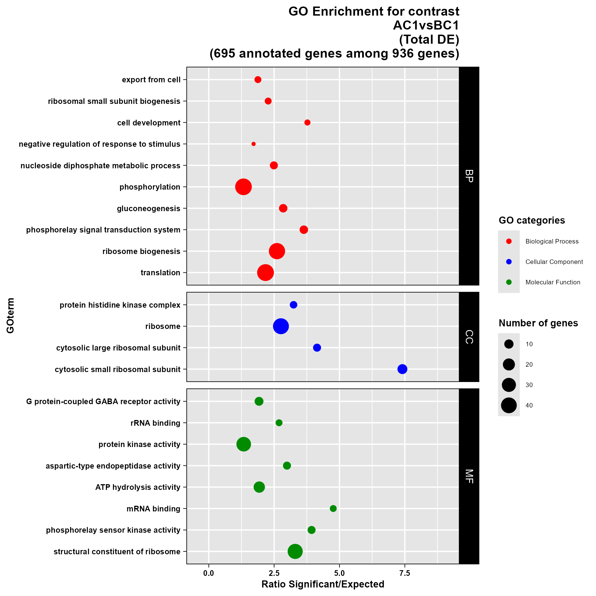
```

Example of one statistical table:
<font size='1'>

GO.ID      | Term                | Annotated | Significant | Expected | statisticTest | Ratio        | GO_cat |
-----------|---------------------|-----------|-------------|----------|---------------|--------------|--------|
GO:0003735 | structural const... |       135 |          36 |    10.81 |       4.6e-11 | 3.3302497687 | MF     |
GO:0000155 | phosphorelay sen... |        22 |           7 |     1.76 |        0.0012 | 3.9772727272 | MF     |
GO:0003729 | mRNA binding        |        13 |           5 |     1.04 |        0.0024 | 4.8076923076 | MF     |
GO:0036094 | small molecule b... |      1327 |         105 |   106.24 |        0.0038 | 0.9883283132 | MF     |
... |

</font>
Explications of some columns:

 - **Annotated:** number of genes in your genome annotated with GO-terms.
 - **Significant:** number of genes belonging to your input which are annotated with the GO-term.
 - **Expected:** show an estimate of the number of genes a node of size Annotated would have if the significant genes were to be randomly selected from the gene universe.
 - **statisticTest:** result of fisher test
 
Finally, for each analysis, a **"NameOfTheContrast_SignificantGO"** directory is created in which you can find, for each enriched GO-term, the genes that enabled enrichment. 


# Co-Expression Analysis

## Gene clustering

ClustAndGO function is based on "coseq" package for gene clustering and enables to highlight DE genes (in at least 1 contrast) that have the same expression profile. Genes profiles are clustered using adapted transformations and mixture models or K-means algorithm. A model selection criteria is proposed to choose an appropriate number of clusters.

Through ClustAndGO, the list of the genes of each cluster is extracted as a table and graphical outputs are produced to visualize cluster profiles. The function provided in AskoR also allows automatically to describe each cluster (gene expression, gene lists shared with several contrasts, GO-enrichmment).

First, you have to define some parameters for the analysis. Here are the parameters to define for gene clustering analysis:

- ```parameters$GO_threshold``` &nbsp;the significant threshold used to filter p-values

- ```parameters$coseq_data```  &nbsp;the type of data you want to cluster
  - **"LogScaledData"**: log2(data+1); for this you have to put parameters$coseq_transformation="none"
  - **"ExpressionProfiles"**: sample expression / sum of expression in all samples - choosen default approach by coseq creators
        
- ```parameters$coseq_model``` &nbsp;the algorythm for the clustering 'kmeans', 'Normal' (gaussian mixture model).

- ```parameters$coseq_transformation``` &nbsp;the transformation applied to the expression profiles for the clustering - sample expression / sum of expression in all samples, ("voom", "logRPKM", "arcsin", "logit", "logMedianRef", "logclr", "clr", "alr", "ilr", "none").

- ```parameters$coseq_ClustersNb``` &nbsp;the number of clusters to be build
  - **a fixed number from 2 to 25**, for example: parameters$coseq_ClustersNb=4
  - **(by default) fixed range 2:25** (parameters$coseq_ClustersNb=2:25). Coseq choose a number chosen between 2 to 25 clusters based on the Integrated Completed Likelihood (ICL) criterion (in the case of the Gaussian mixture model) or on the slope heuristics (in the case of the K-means algorithm)
        
- ```parameters$coseq_HeatmapOrderSample``` &nbsp;choose "TRUE" if you don't want the samples to be clustered and prefer to keep the initial sample order.

**Note**: If a GO annotation file has been provided by the user, don't forget also to define parameters for GO enrichment analysis in each cluster (Cf. GO enrichment Section for parameters).

You can then run clustering analysis to highlight co-expression profiles:


```{r clust1, eval=FALSE}
# Parameters for gene clustering
parameters$coseq_data = "ExpressionProfiles"
parameters$coseq_model = "kmeans"     
parameters$coseq_transformation = "clr"
parameters$coseq_ClustersNb = 4   
parameters$coseq_HeatmapOrderSample = FALSE

# Parameters for GO enrichment 
parameters$GO_threshold = 0.05
parameters$GO_min_num_genes = 10
parameters$GO_algo = "weight01"
parameters$GO_stats = "fisher"

# Parameters for GO enrichment graphs
parameters$GO_max_top_terms = 10
parameters$GO_min_sig_genes = 2
parameters$Ratio_threshold = 2

# run analysis
clust<-ClustAndGO(asko_norm,resDEG,parameters, data)
```

A directory **"DEG_test/Clustering/OnDEgenes/"** is created, in which you will find one directory per analysis (the name will depend on the model, the transformation, and the number of clusters chosen).

**Recommendations**

- Coseq is designed to clusterize expression profiles (sample expression / sum of expression in all samples) with one of the transformations available but some users may want to clusterize directly the scaled log+1 expression. In that case, set ```parameters$coseq_data="LogScaledData"``` &nbsp and ```parameters$coseq_transformation="none" ```

- "K-means" model is widely used and quite fast but it is a particular case of a gaussian mixture model where samples are suposed to be independant (correlation between samples = 0 and same variance). If you want to use a more flexible model, you set the parameters$coseq_model="Normal" to apply a global gaussian mixture model.

- When using "K-means" model, the "clr" transformation is recommended by coseq in many cases but, if you are trying to identify very specific clusters (for example tissue specific clusters) you can test the "logclr" transformation.

- When using "Normal" model, "arcsin" or "logit" transformations should be tested at the beginning.

- Analyze your results of GO-enrichment very carefully if you have less than 100 genes in the cluster.

## Global outputs

Several files (tables and plots) are saved in the directory of the analysis and one directory per cluster is created (which contains detailed files for each cluster).

### Tables

 | | clusters.coexpr. | AC1 | AC2 | AC3 | BC1 | BC2 | BC3 | AC1vsAC2 | AC1vsAC3 | AC2vsAC3 | BC1vsBC2 | BC1vsBC3 | BC2vsBC3 | AC1vsBC1 | AC2vsBC2 | AC3vsBC3 | Description |
 |:-|:-:|-:|-:|-:|-:|-:|-:|:-:|:-:|:-:|:-:|:-:|:-:|:-:|:-:|:-:|:-|
 | Gene_000003 | 2 | 0.4419681 | 1.765120 | 1.041042 | 1.698956 | 1.0034991 | 0.8513948 | -1 | 0 | 0 | 0 | 0 | 0 | -1 | 0 | 0 | histone-lysine n-methyltransferase nsd2 |
 | Gene_000004 | 1 | 47.5222800 | 33.976130 | 33.823440 | 42.246010 | 51.9250600 | 46.6207000 | 1 | 1 | 0 | 0 | 0 | 0 | 0 | -1 | 0 | hypothetical protein pbra 009496 |
 | Gene_000006 | 2 | 0.4632453 | 2.305171 | 1.047562 | 1.402427 | 0.6600896 | 0.6161691 | -1 | 0 | 0 | 0 | 0 | 0 | 0 | 1 | 0 | cilia- and flagella-associated 57-like |
 | ... |
<br/>

### Plots

A boxplot is produced to visualize the log scaled expression of all the genes in each cluster and each experimental condition:

```{r plot1clust, fig.cap="Boxplot", echo=FALSE, out.width='50%', fig.align='center', out.extra='style="display:inline-block;margin:0;padding:0;"'}
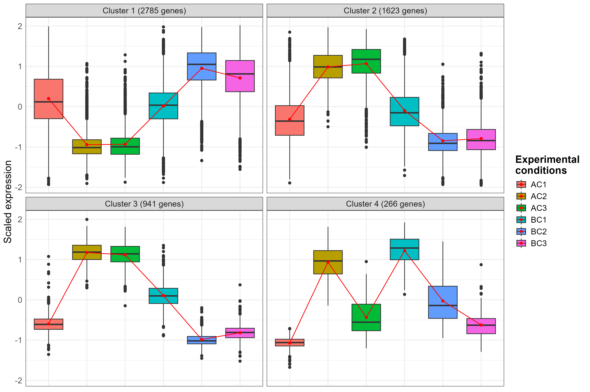
```

This is also represented as a heatmap, which can more easily enable to see gene proportion in each cluster and each experimental condition:

```{r plot2clust, fig.cap="Heatmap", echo=FALSE, out.width='50%', fig.align='center', out.extra='style="display:inline-block;margin:0;padding:0;"'}
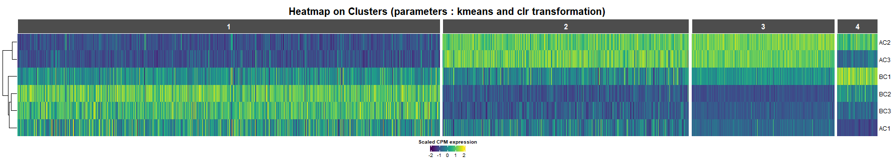
```

Coseq package produces probability graphs that are concatenated in one graph in ClustAndGO function. On the left you can see if clusters are robusts (if the gene is affiliated to the same cluster for more than 80% of the iterations it appears in black and its affiliation is supposed to be robust - the affiliation of red genes is less robust). On the right, you can see the number (and so evaluate the proportion) of robust and non-robust genes in each cluster:

```{r plot3clust, fig.cap="Probabilities", echo=FALSE, out.width='50%', fig.align='center', out.extra='style="display:inline-block;margin:0;padding:0;"'}
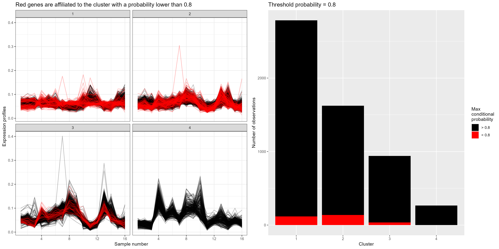
```

### Per-cluster outputs

In the directory of the clustering analysis, a supplementary directory is created for each cluster in which you can find tables, plots, and a sub-directory which contains the lists of the genes for each GO-term enriched in the cluster.

#### Scaled-expression boxplot

First, for each cluster, log scaled expression is represented for the genes of the cluster. 
```{r plot3bisclust, fig.cap="Probabilities", echo=FALSE, out.width='70%', fig.align='center', out.extra='style="display:inline-block;margin:0;padding:0;"'}
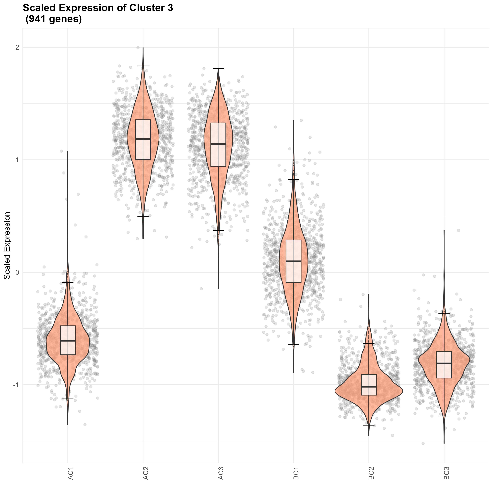
```


#### UpSet plot of DEGs in contrasts

To identify in each cluster the DE genes specific to each contrast or common to several, the intersections between DE gene lists are represented with the UpSetR package.

```{r plot4clust, fig.cap="Probabilities", echo=FALSE, out.width='70%', fig.align='center', out.extra='style="display:inline-block;margin:0;padding:0;"'}
knitr::include_graphics("../inst/extdata/DEG_test/Clustering/OnDEgenes/kmeans_clr_4clusters/Cluster_3/DEG_test_UpSet_kmeans_clr_Cluster_3.png")
```

#### GO-enrichment

If a GO-annotation file is provided by the user, ClustAndGO performs automatically GO-term enrichment analysis for each cluster.

**Bargraphs** \
for each GO category are saved with the information of the enrichment ratio, the number of genes behind the enrichment and the p-value :

```{r plot5clust, fig.cap="GO-enrichment", echo=FALSE, out.width='40%', fig.align='center', out.extra='style="display:inline-block;margin:0;padding:0;"'}
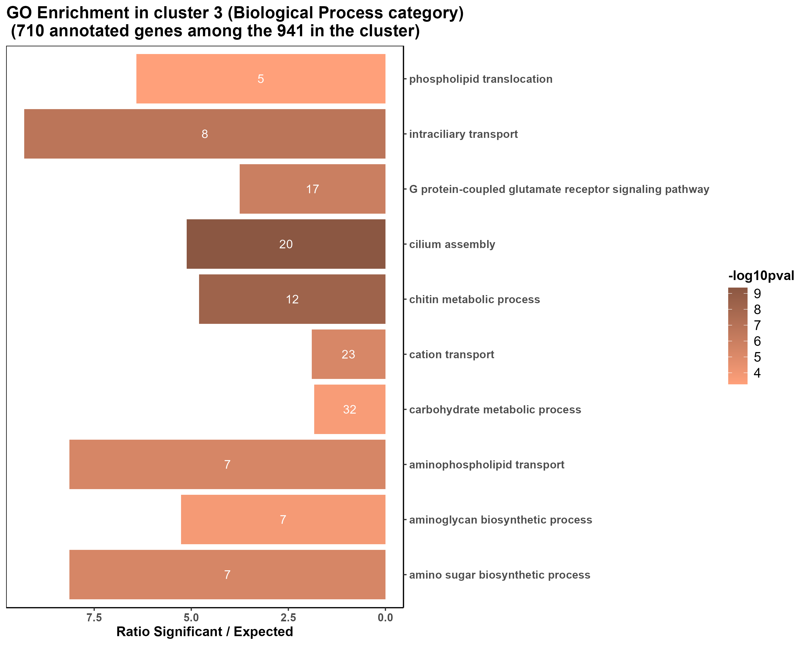
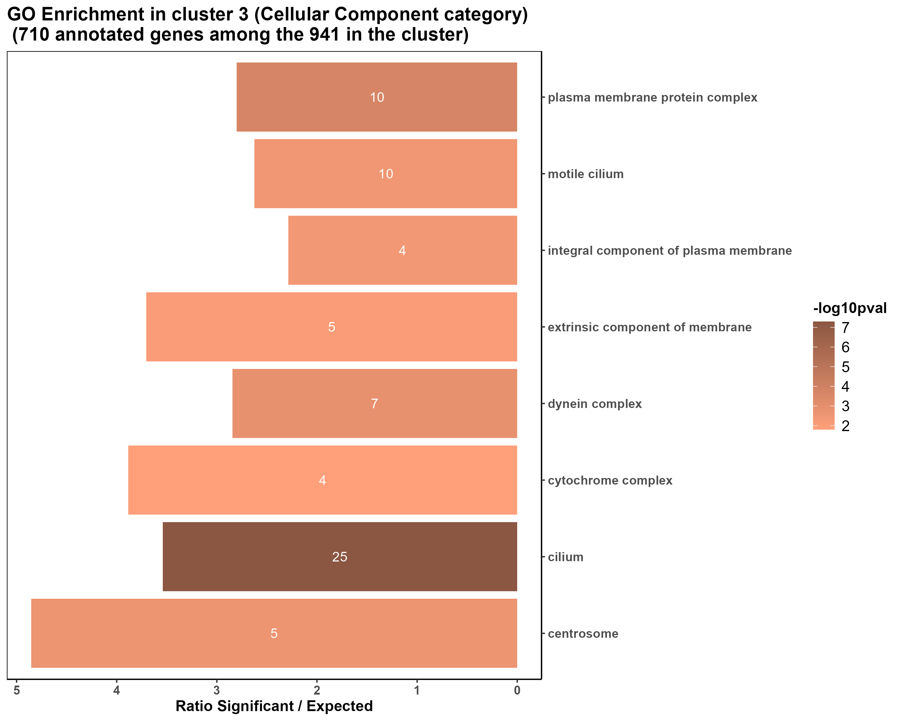
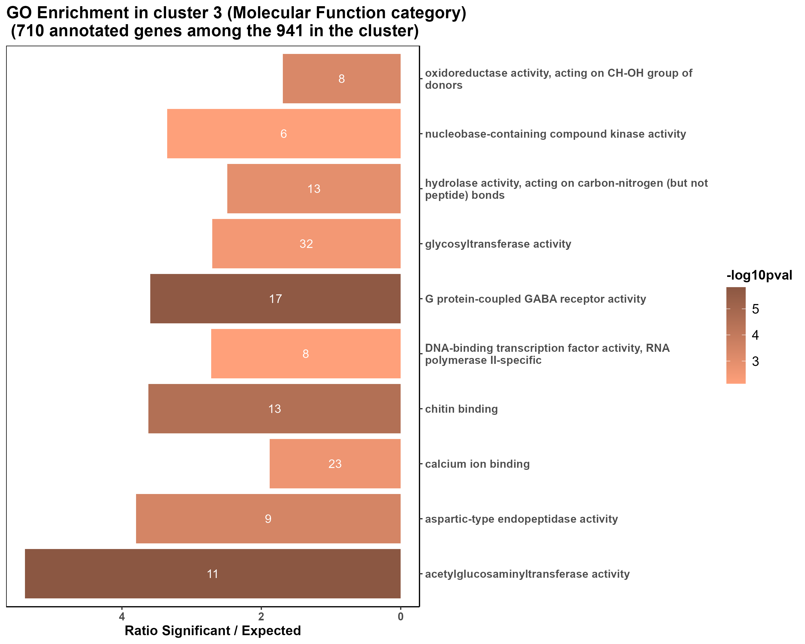

```


**Enrichment of contrast-specific genes**\
Since not all genes are DE in all contrasts (clustering performed on the list of DE genes in at least 1 contrast of the experiment), a representation highlighting the number of DE genes in each cluster is created.

The plot shows, for each contrast of interest, the percentage of DE genes in the contrast in the cluster compared to the total number of DE genes in the contrast : "*" indicates whether the contrast is enriched in genes of the cluster. To define this significance, a Chi2 test is performed between 1) the (observed) proportion of genes in each contrast belonging to the cluster relative to the total number of genes in the contrast, and 2) the (expected) proportion of total genes in the cluster relative to the total number of DE genes in at least 1 of the contrasts (total number of genes used for clustering).
If the Chi2 p-value is less than 0.05, and the observed proportion is greater than the expected proportion in a particular contrast, the contrast is statistically significantly enriched in genes of the cluster (data embedded in the graph: "***" 0.001; "**" 0.01; "*" 0.05).

For example in cluster 3, the following plot shows that more than 750 genes are DE in contrast AC1vsAC3 and account for 40.5% of the total DE genes in contrast AC1vsAC3 (whereas the cluster 3 represents only 16.8% of the total number of total DE genes); this proportion shows that contrast AC1vsAC3 is significantly ("***") enriched in genes of the cluster 3 (the contrast would not have been significantly enriched with genes of the cluster 3 if 16.8% of its genes had belonged to cluster 3, according to a random distribution of genes in the contrasts).

**Be careful:** the lower the number of genes (in the contrast and/or in the cluster), the less reliable the Chi2 test is. The interpretation of the significance is then difficult. 

```{r enrichcontrast, fig.cap="Gene enrichment in contrasts", echo=FALSE, out.width='70%', fig.align='center', out.extra='style="display:inline-block;margin:0;padding:0;"'}
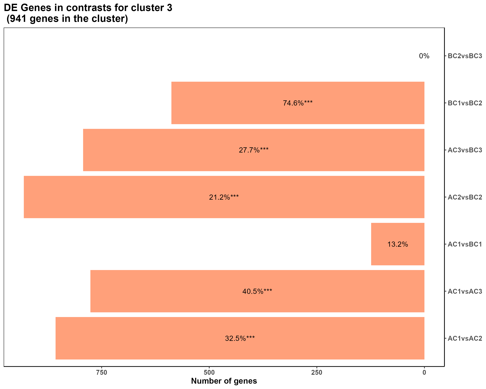
```


### To go further ...

If you want, then you can include genes that are not DE in an additional (artificial) cluster and visualize it with the clusters identified on the DE genes with ClustAndGO function. This will also realize a GO-enrichment on these genes in a **"NOT_DE"** folder.

NOTE: you have to run this function after creating "clust" object with your ClustAndGO analysis (you can create multiple "clust" objects with different names and run the function on it).

```{r clust10, eval=FALSE}
IncludeNonDEgenes_InClustering(data, asko_norm, resDEG, parameters, clust)
```

It can allow you to visualize the profile of the genes that are not DE and their proportion in the whole experiment (heatmap is also available):

```{r nonDE, fig.cap="Clustering with non DE genes", echo=FALSE, out.width='70%', fig.align='center', out.extra='style="display:inline-block;margin:0;padding:0;"'}
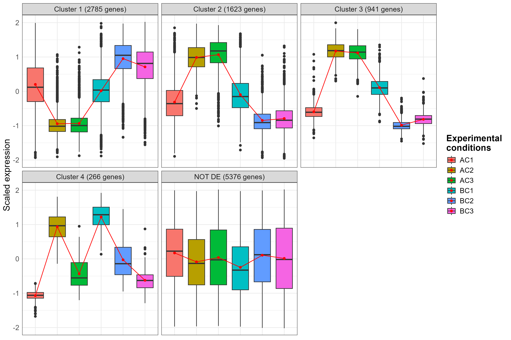
```


# Tips and tricks

## How to perform a GO-enrichment analysis on a specific gene list ?

If you want, you can also perform GO-enrichment on a specific list of genes (list of interest from another study, list of genes hightly expressed, ...). In this case, you can use the GOenrichment function with two supplementary parameters: the list of the names of the genes you want to analyze and the name you want to set for this list. This function produces the same outputs than the GOenrichment function used on contrasts in 'GO Enrichment Analysis' part.The directory used for the outputs is **"DEG_test/GOenrichment/OnSpecificList_NameOfTheList/"**. Here is an example on the 1000 first genes of the list:

```{r GO2, eval=FALSE}
list=rownames(resDEG[1:1000,])
GOenrichment(resDEG, data, parameters, list, "First1000genes")
```


## How to perform a clustering analysis on a specific gene list ?

On the same way, you can perform clustering on a specific list of genes (list of interest from another study, list of genes hightly expressed, ...). In this case, you can use the ClustAndGO function with two supplementary parameters: the list of the names of the genes you want to analyze and the name you want to set for this list. This function produces the same outputs than the ClustAndGO function used on all the DE genes in 'Gene clustering for Coexpression analysis' part. The directory used for the outputs is **"DEG_test/Clustering/NameOfTheList/"**.Here is an example on the 1000 first genes of the list:

```{r clust2, eval=FALSE}
list=rownames(resDEG[1:1000,])
clust <- ClustAndGO(asko_norm,resDEG,parameters, data, list, "First1000genes")
```


## How to extract gene informations from a specific gene list ?

Another function have been developed to enable the user to obtain heatmap expression and summary table (with all informations generated during the analysis : name of the genes, normalized expression in CPM in each experimental condition, DE status in contrasts, gene description, and cluster membership).

In addition to the objects "resDEG" and "data", the function needs a list containing the names of the genes you want to analyze and a name for the list. A **"DEG_test/GeneListExplore/NameOfTheList/"** directory is created.

First, you can draw a heatmap with scaled expression (CPM) of a specific gene list of interest together with the status (OVER/UNDER-differentially expressed or not). Here is an example with the first 25 genes of the dataset:

```{r geneinfo1, eval=FALSE}
list=rownames(resDEG[1:25,])
GeneInfo_OnList(list, resDEG, data, parameters,"First25genes")
```


```{r GOgraph2, fig.cap="Gene information", echo=FALSE, out.width='70%',  out.extra='style="display:inline-block;margin:0;padding:0;"'}
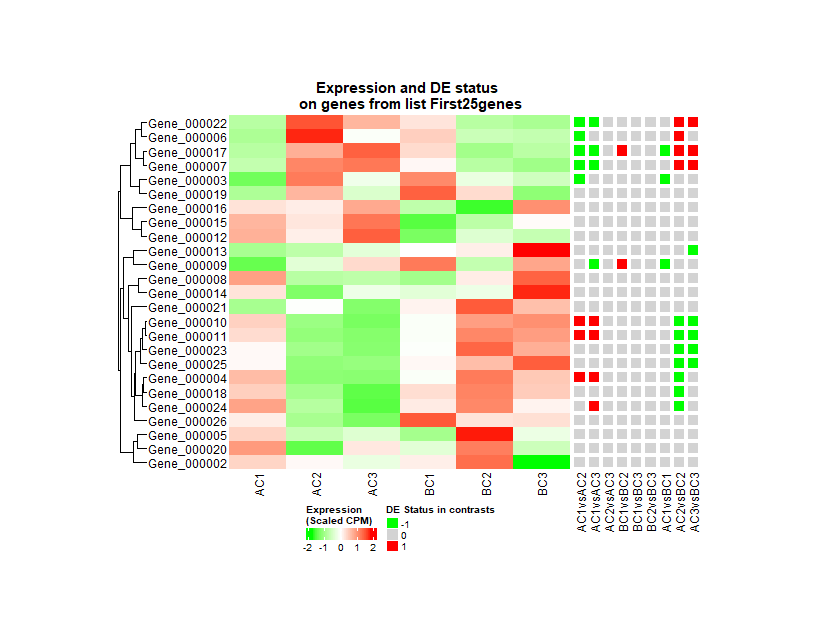
```


In this heatmap, a hierarchical clustering in performed on the genes (default clustering of the Heatmap() function of the ComplexHeatmap package). But if you had run ClustAndGO analysis and so created "clust" object, you can also sort the genes by clusters by adding "clust" as a supplementary parameter:

```{r geneinfo2, eval=FALSE}
list=rownames(resDEG[1:25,])
GeneInfo_OnList(list, resDEG, data, parameters, "First25genes_WithClust", clust)
```

```{r GOgraph3, fig.cap="Gene information with clustering", echo=FALSE, out.width='70%',  out.extra='style="display:inline-block;margin:0;padding:0;"'}
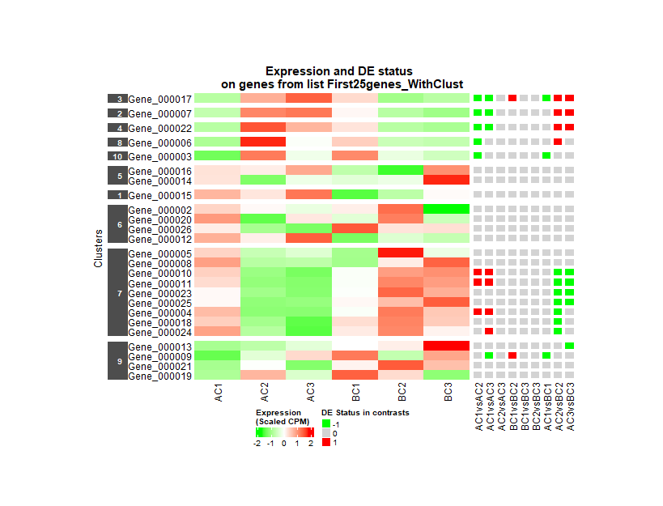
```

In this heatmap, a hierarchical clustering in performed on the genes (default clustering of the Heatmap() function of the ComplexHeatmap package). But if you had run ClustAndGO analysis and so created "clust" object, you can also sort the genes by clusters by adding "clust" as a supplementary parameter:


```{r geneinfo3, eval=FALSE}
conditionsToDraw = c("AC1", "AC2", "AC3")
contrastToDraw = c("AC1vsAC2","AC1vsAC3","AC2vsAC3")
GeneInfo_OnList(list, resDEG, data, parameters, "First25genes_WithClust", clustering=clust, conditions=conditionsToDraw, contrasts=contrastToDraw)
```


```{r GOgraph4, fig.cap="Subset gene information with clustering", echo=FALSE, out.width='70%',  out.extra='style="display:inline-block;margin:0;padding:0;"'}
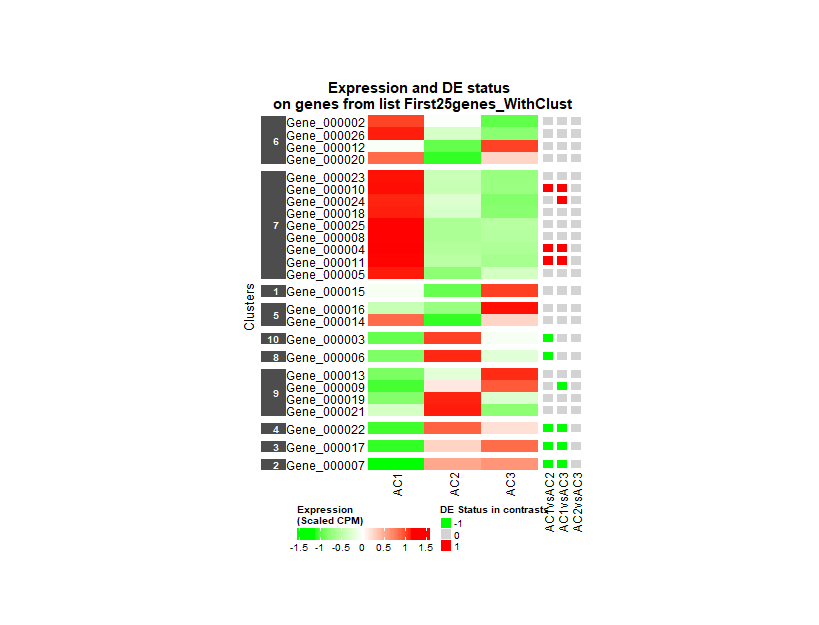
```

##############################################
# ATTENTION : enlever le source au chargement du package !!!!!!#
##############################################
